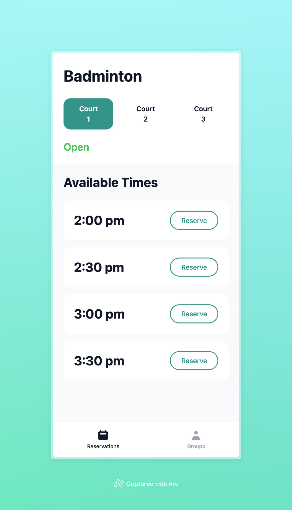

# 🏸 Badminton Court Reservation App

> A modern, real-time court management application built for badminton facilities, providing seamless court reservations and session management with automatic timer controls.

## 🎯 Overview

The Badminton Court Reservation System is a comprehensive web application designed to streamline court management for badminton facilities. It offers real-time court status tracking, automated session management, and a user-friendly interface for both players and facility administrators.

## ✨ Key Features

### 🔐 Secure Authentication

- **Google OAuth 2.0 Integration**: Seamless sign-in with Google accounts
- **JWT Token Security**: Secure session management and API authentication
- **User Profile Management**: Automatic user registration and profile handling

### 🏟️ Real-Time Court Management

- **Live Court Status**: Real-time updates showing court availability and usage
- **Multi-Court Support**: Manage multiple courts simultaneously (Courts 1-3)
- **Visual Status Indicators**: Color-coded system (Green: Available, Red: In Use)
- **Timer Integration**: Precise countdown timers for active court sessions

### ⏰ Intelligent Session Control

- **Automatic Timer Management**: 30-minute court sessions with real-time countdown
- **Auto-Completion**: Courts automatically release when timer expires
- **Manual Release Option**: Early session termination when needed
- **Session History**: Track completed and expired sessions

### 📅 Advanced Reservation System

- **Time Slot Management**: Pre-defined time slots for organized scheduling
- **Single Reservation Policy**: One active reservation per user to ensure fair access
- **Conflict Prevention**: Automatic detection and prevention of booking conflicts
- **Queue Visibility**: See how many players are waiting for each court

### 👥 Multi-User Experience

- **Concurrent User Support**: Multiple users can interact with the system simultaneously
- **User-Specific Views**: Personalized dashboard showing individual reservations and permissions
- **Cross-User Conflict Resolution**: Intelligent handling of competing reservation requests
- **Real-Time Synchronization**: All users see updates within 1-5 seconds

### 📱 Responsive User Interface

- **Modern Design**: Clean, intuitive interface built with React and Tailwind CSS
- **Mobile-Friendly**: Responsive design optimized for all device sizes
- **Real-Time Updates**: Live status updates without page refreshes
- **Visual Feedback**: Clear indicators for all user actions and system states

## 🏗️ System Architecture

### Frontend Technology Stack

- **React 18** with TypeScript for type-safe component development
- **Vite** for fast development and optimized builds
- **Tailwind CSS** for modern, responsive styling
- **Real-time State Management** with React hooks and context

### Backend Infrastructure

- **Node.js** with Express.js for robust API services
- **SQLite Database** for reliable data persistence
- **Google OAuth 2.0** with Passport.js for secure authentication
- **JWT Token Management** for stateless session handling

### Database Schema

- **Users**: Profile management and authentication data
- **Courts**: Court configuration and status tracking
- **Reservations**: Time slot bookings and user assignments
- **Court Sessions**: Active usage tracking with timer management
- **Time Slots**: Configurable booking periods

## 🔄 Core Workflows

### Court Reservation Process

1. **Authentication**: User signs in via Google OAuth
2. **Court Selection**: Choose from available courts (1-3)
3. **Time Slot Booking**: Select preferred time from available slots
4. **Conflict Check**: System validates availability and user eligibility
5. **Confirmation**: Reservation confirmed with immediate UI updates

### Court Usage Lifecycle

1. **Court Activation**: User takes reserved court, starting 30-minute timer
2. **Active Session**: Real-time countdown with manual release option
3. **Timer Warnings**: Visual indicators when session nears expiration
4. **Auto-Completion**: Automatic court release when timer reaches zero
5. **Availability Reset**: Court returns to pool for new reservations

### Multi-User Synchronization

- **Live Status Broadcasting**: All connected users receive real-time updates
- **Conflict Resolution**: Automatic handling of simultaneous booking attempts
- **Fair Access Control**: Single reservation limit prevents monopolization
- **Queue Management**: Transparent waiting system for popular time slots

## 🛡️ Security & Reliability

### Authentication Security

- **OAuth 2.0 Standard**: Industry-standard authentication protocol
- **Token Encryption**: Secure JWT tokens with expiration handling
- **Session Management**: Automatic token refresh and logout protection

### Data Protection

- **User Isolation**: Each user only sees their own reservation data
- **API Authentication**: All endpoints protected with token validation
- **Input Validation**: Comprehensive request sanitization and validation

### System Reliability

- **Error Handling**: Graceful degradation with user-friendly error messages
- **Automatic Recovery**: Session cleanup and state restoration
- **Real-time Monitoring**: Comprehensive logging and status tracking

## 📊 Public Features

### Unauthenticated Access

- **Live Court Status**: Public view of current court availability
- **Queue Information**: See waiting lists without account requirement
- **Auto-Refresh**: Status updates every 5 seconds for visitors
- **Visual Indicators**: Color-coded availability with usage timers

## 🔮 Advanced Capabilities

### Smart Restrictions

- **Usage-Based Blocking**: Users with active courts cannot make new reservations
- **Visual Feedback**: Grayed-out options when restrictions apply
- **Context-Aware UI**: Dynamic button states based on user permissions

### Performance Optimization

- **Efficient Updates**: Minimal API calls with intelligent caching
- **Real-time Responsiveness**: Sub-second UI updates for critical actions
- **Scalable Architecture**: Designed for facility expansion and increased usage

---

_Built with modern web technologies for reliable, real-time court management. Designed for badminton facilities seeking to optimize court utilization and enhance player experience._
