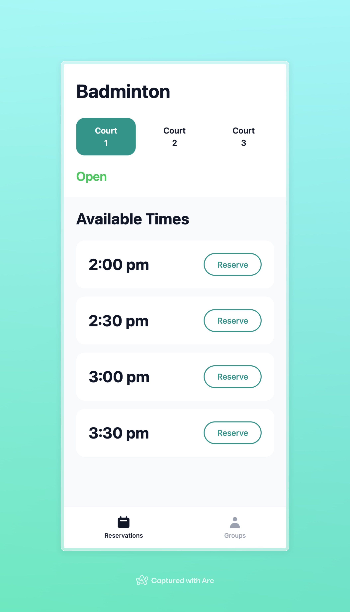

# 🏸 Rsrv



## Inspiration

Managing court reservations at badminton facilities often involves manual tracking, confusion about availability, and unfair queue systems. This project was born from the need to create a fair, transparent, and automated solution that gives all players equal access to courts while eliminating the chaos of manual scheduling. The goal was to build a system where players can see exactly when courts are available, join queues seamlessly, and trust that the system will handle their turn automatically.

## Core Features

### 🔐 Secure Authentication
- Google OAuth 2.0 integration for seamless sign-in
- JWT token-based session management
- Automatic user profile creation and management

### 🏟️ Real-Time Court Management
- Live court status updates (Available/In Use)
- Multi-court support with individual tracking
- Color-coded visual indicators (Green: Available, Red: In Use)
- Precise countdown timers for active sessions

### 📅 Queue-Based Reservation System
- Fair queue positioning for all users
- One active reservation per user/group policy
- Automatic queue advancement when courts become available
- Visual queue position tracking

### 👥 Group Management
- Create groups with unique codes (e.g., "alpha-fire-ocean")
- Join existing groups via code sharing
- Group-wide restrictions (one reservation/session per group)
- Automatic group cleanup when empty

### ⏰ Automated Session Control
- 30-minute court sessions with automatic timers
- Auto-release when timer expires
- Manual early release option
- Automatic queue progression to next player

### 📱 Public Access
- Unauthenticated users can view court status
- Real-time availability updates every 5 seconds
- Queue visibility without login required

## Tech Stack

### Backend
- **Node.js** with **Express.js** - REST API server
- **SQLite** - Lightweight relational database
- **Passport.js** - Google OAuth 2.0 authentication
- **JWT** (jsonwebtoken) - Stateless authentication tokens
- **CORS** - Cross-origin resource sharing for frontend/backend communication

### Frontend
- **React 18** with **TypeScript** - Type-safe component development
- **Vite** - Fast build tool and development server
- **Tailwind CSS 4** - Utility-first styling framework
- **React Context API** - Global state management for auth and groups

## Project Structure

```
badminton-reservation-app/
├── backend/
│   ├── server.js              # Express server and API routes
│   ├── database.js            # SQLite database wrapper
│   ├── auth.js                # Passport OAuth configuration
│   ├── utils/
│   │   └── utils.js           # Helper functions
│   ├── badminton.db           # SQLite database file
│   └── package.json
│
├── badminton-reserve-app/     # Frontend application
│   ├── src/
│   │   ├── components/        # React components
│   │   │   ├── CourtTabs.tsx
│   │   │   ├── AvailableTimes.tsx
│   │   │   ├── GroupHeader.tsx
│   │   │   ├── CreateGroupCard.tsx
│   │   │   ├── JoinGroupCard.tsx
│   │   │   └── ...
│   │   ├── contexts/
│   │   │   └── AuthContext.tsx
│   │   ├── hooks/
│   │   │   └── useGroupManagement.ts
│   │   ├── types/
│   │   │   └── group.ts
│   │   ├── utils/
│   │   │   └── api.ts
│   │   ├── App.tsx            # Main application component
│   │   └── main.tsx           # Application entry point
│   └── package.json
│
├── assets/
│   └── img/
│       └── badminton-reserve-app.jpeg
│
└── README.md
```

## How It Works

### Authentication Flow
1. User clicks "Sign in with Google"
2. Backend redirects to Google OAuth consent screen
3. Google returns user profile to backend callback URL
4. Backend generates JWT token with user ID, email, and name
5. Frontend stores token and uses it for all authenticated API requests

### Reservation & Queue System
1. **Joining Queue**: User selects a court and joins the queue (assigned next available position)
2. **Queue Management**: System maintains ordered queue per court with positions (1, 2, 3...)
3. **Taking Court**: When a court is available, users can manually take it OR queue auto-advances
4. **Auto-Advance**: When a session expires, the first person in queue automatically starts their 30-minute session
5. **Timer Expiration**: After 30 minutes, court automatically releases and next person in queue starts

### Group System
1. **Group Creation**: User creates group → receives unique 3-word code (e.g., "delta-mountain-eagle")
2. **Group Joining**: Other users enter code to join the same group
3. **Group Restrictions**:
   - Only one member can have an active reservation at a time
   - Only one member can use a court at a time
   - Prevents group from monopolizing multiple courts
4. **Group Leaving**: Members can leave anytime; empty groups auto-delete

### Real-Time Updates
- Frontend polls court status every 1-5 seconds
- Session cleanup runs every 5 seconds on backend
- Expired sessions trigger automatic queue advancement
- All users see synchronized state updates

## Use Cases

- **Recreational Badminton Facilities**: Gyms, community centers, and sports clubs can automate court bookings
- **University Recreation Centers**: Fair queue system for student access to courts
- **Private Badminton Clubs**: Member management with group play support
- **Tournament Warm-Up Areas**: Organize practice court access during events
- **Multi-Sport Facilities**: Adaptable to tennis, squash, or other court-based sports

## Development Journey

This project evolved through several key phases:

1. **Initial Authentication**: Started with Google OAuth integration and JWT token system
2. **Court Management**: Built real-time court status tracking with SQLite database
3. **Timer System**: Implemented 30-minute sessions with automatic expiration cleanup
4. **Queue Mechanism**: Developed fair queue positioning and automatic advancement
5. **Group Feature**: Added group management to support friend groups playing together
6. **Public Access**: Opened court status viewing to unauthenticated users
7. **Deployment**: Configured for production with Vercel (frontend) and backend hosting

Key technical challenges solved:
- **Race Conditions**: Preventing double-bookings when multiple users join queue simultaneously
- **Timer Synchronization**: Ensuring accurate countdown across time zones
- **Automatic Queue Progression**: Reliably advancing queue when sessions expire
- **Group Restrictions**: Enforcing one-reservation and one-session per group rules
- **CORS Configuration**: Allowing secure communication between frontend and backend on different domains

## Getting Started

### Prerequisites
- Node.js (v16 or higher)
- npm or yarn
- Google Cloud Console project with OAuth 2.0 credentials

### Backend Setup

1. Navigate to backend directory:
```bash
cd backend
```

2. Install dependencies:
```bash
npm install
```

3. Create `.env` file with the following variables:
```env
PORT=3001
SESSION_SECRET=your_session_secret_here
JWT_SECRET=your_jwt_secret_here
GOOGLE_CLIENT_ID=your_google_client_id
GOOGLE_CLIENT_SECRET=your_google_client_secret
FRONTEND_URL=http://localhost:5173
```

4. Start the server:
```bash
npm start
# or for development with auto-reload:
npm run dev
```

### Frontend Setup

1. Navigate to frontend directory:
```bash
cd badminton-reserve-app
```

2. Install dependencies:
```bash
npm install
```

3. Create `.env` file:
```env
VITE_API_URL=http://localhost:3001
```

4. Start development server:
```bash
npm run dev
```

5. Open browser to `http://localhost:5173`

### Database Initialization

The SQLite database will be automatically created on first run with the following tables:
- `users` - User profiles from Google OAuth
- `courts` - Court definitions (Courts 1-3)
- `reservations` - Queue positions for each court
- `court_sessions` - Active 30-minute sessions
- `groups` - Group definitions with unique codes
- `group_members` - Many-to-many relationship between users and groups

## Future Enhancements

- **Push Notifications**: Alert users when their queue position is approaching or court is ready
- **Email Notifications**: Send confirmation emails for reservations and session starts
- **Admin Dashboard**: Facility management interface for creating/deactivating courts, viewing analytics
- **Booking History**: Allow users to view their past court usage and statistics
- **Dynamic Session Duration**: Let admins configure custom session lengths (15, 30, 60 minutes)
- **Mobile App**: Native iOS/Android apps with better real-time notifications
- **Calendar Integration**: Sync reservations with Google Calendar or iCal
- **Payment Integration**: Add Stripe/PayPal for paid court reservations
- **Court Equipment Checkout**: Track shuttlecocks, nets, and other equipment
- **Player Ratings**: Skill-based matchmaking for finding partners
- **Tournament Mode**: Special scheduling for organized competitions
- **Multi-Facility Support**: Expand to support multiple locations under one system
- **Analytics Dashboard**: Usage statistics, peak times, and user engagement metrics

---

_Built with modern web technologies for reliable, real-time court management._
